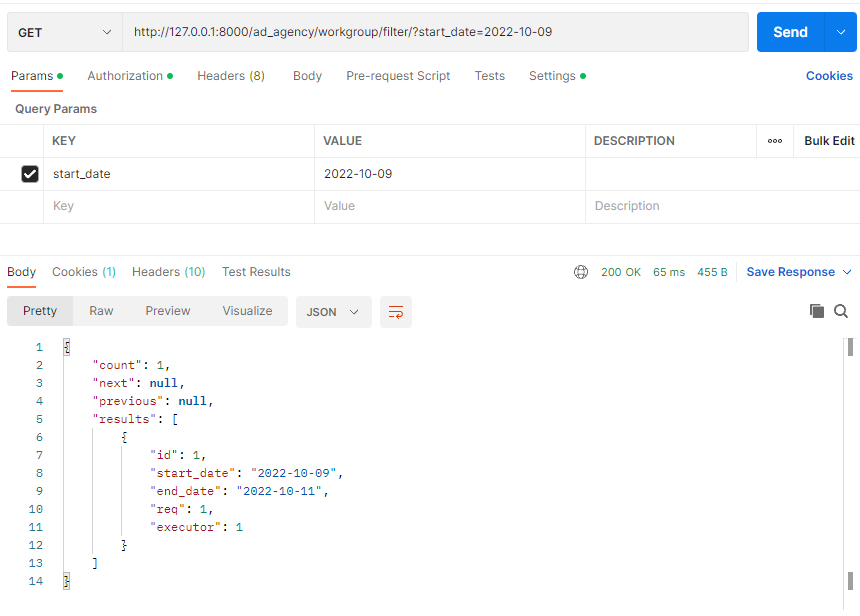
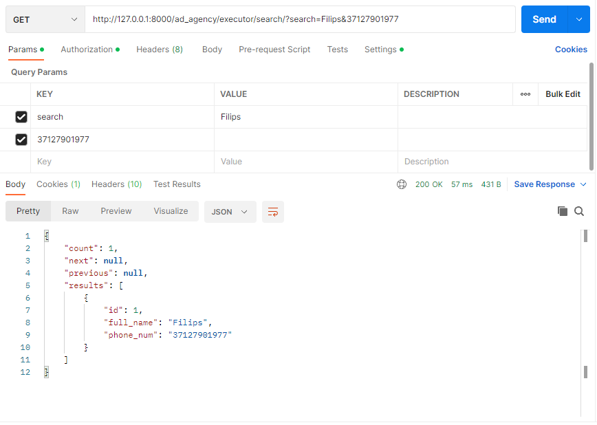
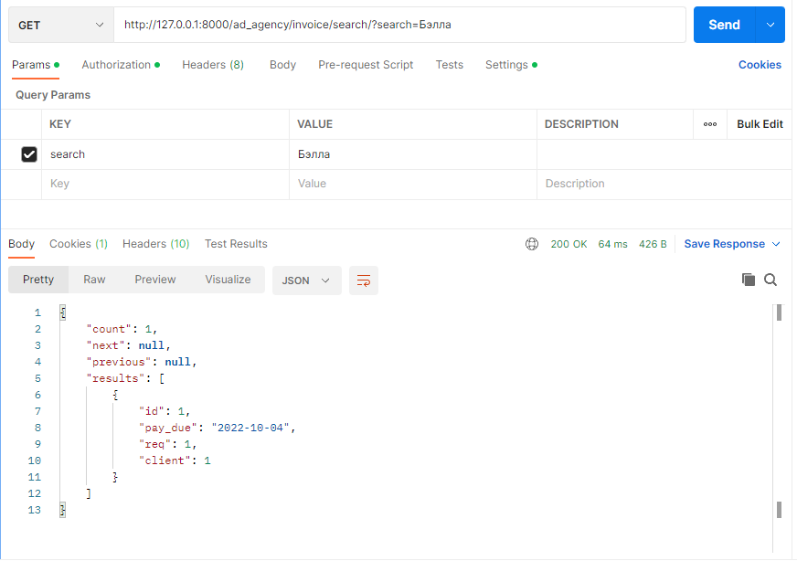
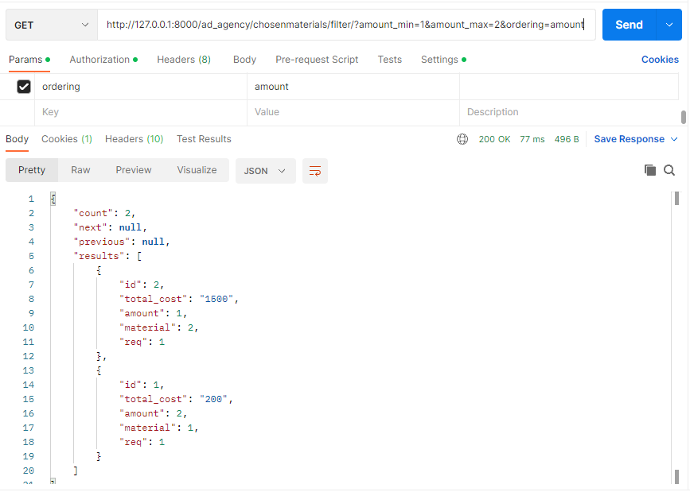

#### Задание 2.1.2

Реализвать в ручную следующие фильтры (Необходимо использовать библиотеку django-filters:

- сортировка по дате, поиск, поиск по полям из связной таблицы
- сортировка в диапазоне цен, дат или каких-либо других числовых значений

## Фильтрация рабочих групп по дате начала работы

### views.py
```python
class WorkGroupFilterView(generics.ListAPIView):
    queryset = WorkGroup.objects.all()
    serializer_class = WorkGroupViewSerializer
    filter_backends = [DjangoFilterBackend]
    filterset_fields = ['start_date']

```



## Поиск исполнителя по имени и номеру телефона


### views.py
```python
class ExecutorSearchFilterView(generics.ListAPIView):
    queryset = Executor.objects.all()
    serializer_class = ExecutorViewSerializer
    filter_backends = [DjangoFilterBackend, SearchFilter]
    search_fields = ['full_name', 'phone_num']

```



## Поиск информации о заявке


### views.py
```python
class InvoiceSearchFilterView(generics.ListAPIView):
    queryset = Invoice.objects.all()
    serializer_class = InvoiceViewSerializer
    filter_backends = [DjangoFilterBackend, SearchFilter]
    search_fields = ['client__contact_person']

```



## Сортировка в диапазоне количества используемых материалов


### views.py
```python
class ChosenMaterialsRangeFilterView(generics.ListAPIView):
    queryset = ChosenMaterials.objects.all()
    serializer_class = ChosenMaterialsViewSerializer
    filter_backends = [filters.DjangoFilterBackend]
    filterset_class = ChosenMaterialsRangeFilter

```

### filters.py
```python
from django_filters import rest_framework as filters
from .models import *


class ChosenMaterialsRangeFilter(filters.FilterSet):
    amount = filters.RangeFilter()
    ordering = filters.OrderingFilter(fields=(('amount'),))

    class Meta:
        model = ChosenMaterials
        fields = ['amount']

```

