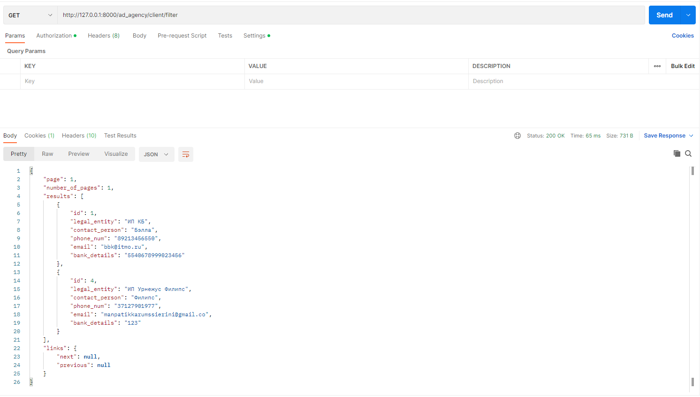

#### Задание 2.2.2

Написать и применить метод пагинации, который, кроме обычного вывода вернет количество страниц пагинации и номер текущей страницы

### Кастомный класс пагинации:

pagination.py
```python
from rest_framework import pagination
from rest_framework.response import Response


class CustomPagination(pagination.PageNumberPagination):
    def get_paginated_response(self, data):
        return Response({
            'page': self.page.number,
            'number_of_pages': self.page.paginator.num_pages,
            'results': data,
            'links': {
                'next': self.get_next_link(),
                'previous': self.get_previous_link()
            },
        })

```

