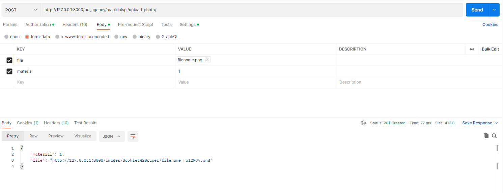
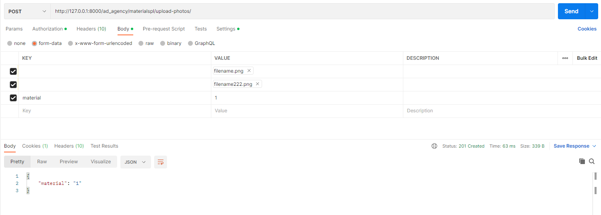

#### Задание 2.3.1

Реализовать следующие ендпоинты:

- Ендпоинт для загрузки файлов, с указанием внешнего ключа на связный объект и сохранением имени и размера файла в базе данных.
- Ендпоинт для сохранения нескольких файлов и валидации на максимальный размер файла и доступные для загрузки расширения файлов.

### Загрузка одного файла

models.py
```python
def get_upload_path(instance, filename):
    return 'images/{0}/{1}'.format(instance.material, filename)


class MaterialsPhoto(models.Model):
    material = models.ForeignKey('MaterialsPL', on_delete=models.CASCADE, verbose_name='Материал')
    filename = models.CharField(max_length=50, verbose_name='Имя файла')
    size = models.IntegerField(verbose_name='Размер файла')
    file = models.FileField(validators=[validate_file_size, validate_file_type],
                            upload_to=get_upload_path)

    def save(self, *args, **kwargs):
        self.size = self.file.size
        self.filename = self.file.name
        super(MaterialsPhoto, self).save(*args, **kwargs)
```

validators.py
```python
from django.core.exceptions import ValidationError
import magic


def validate_file_size(file_upload):
    if file_upload.size > 1024 * 1024:
        raise ValidationError('Файл слишком большой.')


def validate_file_type(file_upload):
    file_type = magic.from_buffer(file_upload.read(), mime=True)
    if file_type not in ('image/png', 'image/jpeg', 'image/jpg'):
        raise ValidationError('Загрузите, пожалуйста, картинку в формате PNG или JPG.')
```

serializer.py
```python
class MaterialsPhotoSerializer(serializers.ModelSerializer):
    class Meta:
        model = MaterialsPhoto
        fields = ['material', 'file']

```

views.py
```python
class MaterialsPhotoAPIView(generics.CreateAPIView):
    queryset = MaterialsPhoto.objects.all()
    serializer_class = MaterialsPhotoSerializer

```




### Загрузка двух файлов

views.py
```python
class MaterialsPhotosAPIView(generics.CreateAPIView):
    queryset = MaterialsPhoto.objects.all()
    serializer_class = MaterialsPhotoSerializer

    def post(self, request, *args, **kwargs):
        files = request.FILES.getlist('file')
        for file in files:
            file_instance = MaterialsPhoto(material=MaterialsPL.objects.get(
                id=request.POST.get('material')), file=file)
            file_instance.save()
        return Response(request.data, status=status.HTTP_201_CREATED)

```

