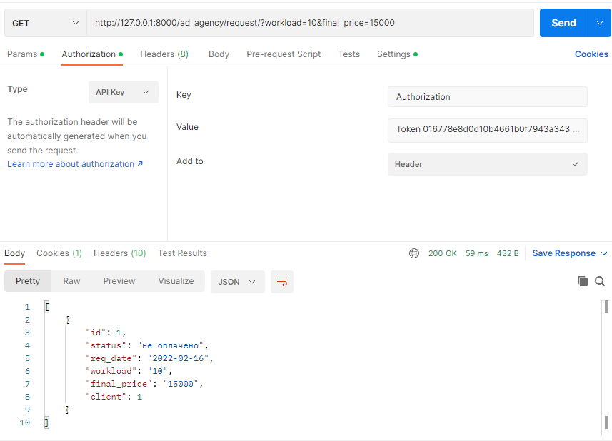

#### Задание 2.1.1

Реализвать в ручную следующие фильтры (в ручную значит, что Вам необходимо передать в url параметры, далее переопределть метод list или get_queryset, c целью взять параметры из url-адреса, выполнить с ними запрос и вернуть responce пользователю):

- принимает параметр из url-адреса и выводит отфильтрованные данные.  (GET, ListAPIView)
### views.py

```python.py
class ClientFilterView(generics.ListAPIView):
    serializer_class = ClientViewSerializer
    pagination_class = CustomPagination

    def get_queryset(self):
        queryset = Client.objects.all()
        legal_entity = self.request.query_params.get('legal_entity')
        if legal_entity:
            queryset = queryset.filter(legal_entity=legal_entity)
        return queryset

```


- принимает 2 параметра из url-адреса и выводит отфильтрованные данные. (GET, ListAPIView)
### views.py

```python.py
class ServicesPLFilterView(generics.ListAPIView):
    serializer_class = ServicesPLViewSerializer

    def get_queryset(self):
        queryset = ServicesPL.objects.all()
        service_type = self.request.query_params.get('service_type')
        price = self.request.query_params.get('price')
        if service_type:
            queryset = queryset.filter(service_type=service_type)
        if price:
            queryset = queryset.filter(price=price)
        return queryset

```


- принимает 2 параметра из url-адреса и выводит отфильтрованные данные, если пользователь авторизован и неотфильтрованные, если не авторизован. (GET, ListAPIView)
### views.py

```python.py
class RequestFilterView(generics.ListAPIView):
    serializer_class = RequestViewSerializer

    def get_queryset(self):
        queryset = Request.objects.all()
        if self.request.user.is_authenticated:
            status = self.request.query_params.get('status')
            final_price = self.request.query_params.get('final_price')
            if status:
                queryset = queryset.filter(status=status)
            if final_price:
                queryset = queryset.filter(final_price=final_price)
        return queryset

```
