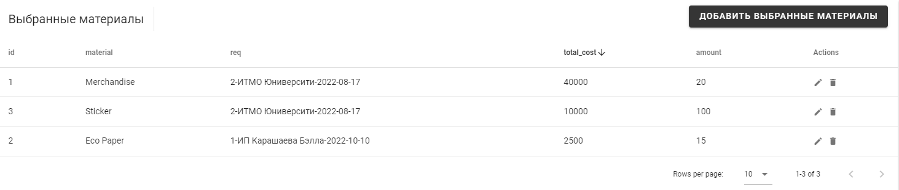
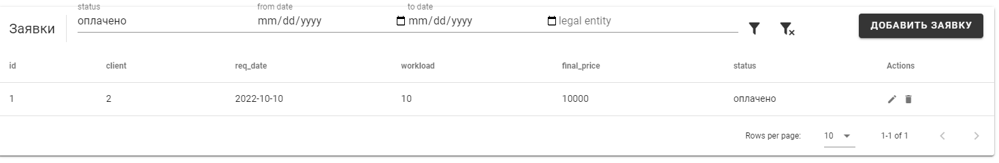
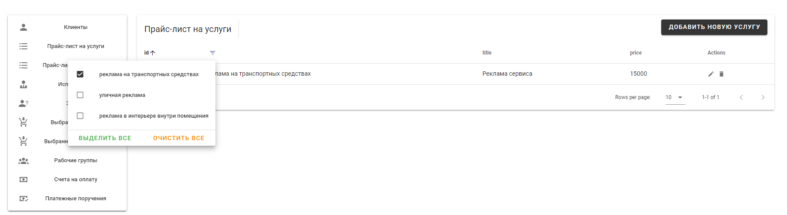
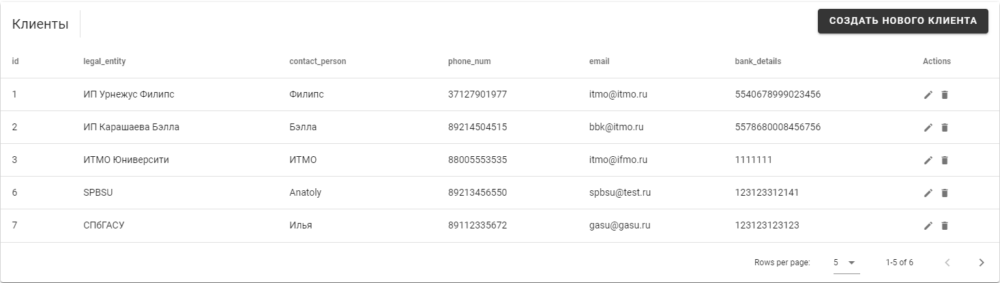

#### Задание 4.1.1

Необходимо реализовать интерфейс списков объектов, в котором подключить фильтры из второй лабораторной.

### Сортировка данных (по цене)

### Поиск заказов (по статусу оплаты)

### фильтры для поиска

### Пример пагинации

