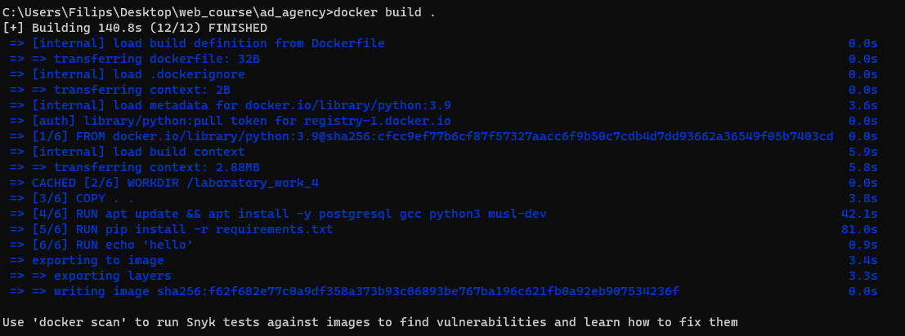
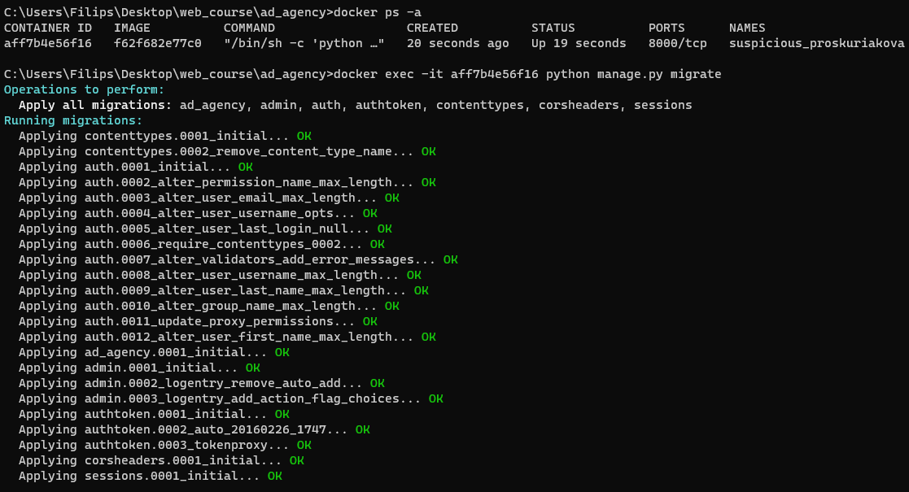

# Задание:

1. Написать Dockerfile для запуска бэкенд части проекта из курса "Web-программирование".
2. Выполнить следующие действия:

    - Изменить модель БД Django
    - Зайти в контейнер и выполнить миграции (https://www.mousedc.ru/learning/565-komanda-docker-konteyner/)

# Backend
```dockerfile
FROM python:3.9

WORKDIR /app

ENV PYTHONDONTWRITEBYTECODE 1
ENV PYTHONUNBUFFERED 1

RUN apt update && apt install -y postgresql gcc python3 musl-dev


RUN pip install --upgrade pip
COPY ./requirements.txt .
RUN pip install -r requirements.txt

COPY . /app

CMD ["python", "manage.py", "runserver", "0.0.0.0:8000" ]
```

# Frontend
```dockerfile
FROM node:12

RUN apt-get update && apt-get upgrade -y && apt-get autoclean

RUN mkdir /front
WORKDIR /front
COPY package*.json ./

RUN npm install
RUN npm install -g @vue/cli
COPY . .

CMD ["npm", "run", "serve"]
```

Запустим контейнер



Применим миграции

