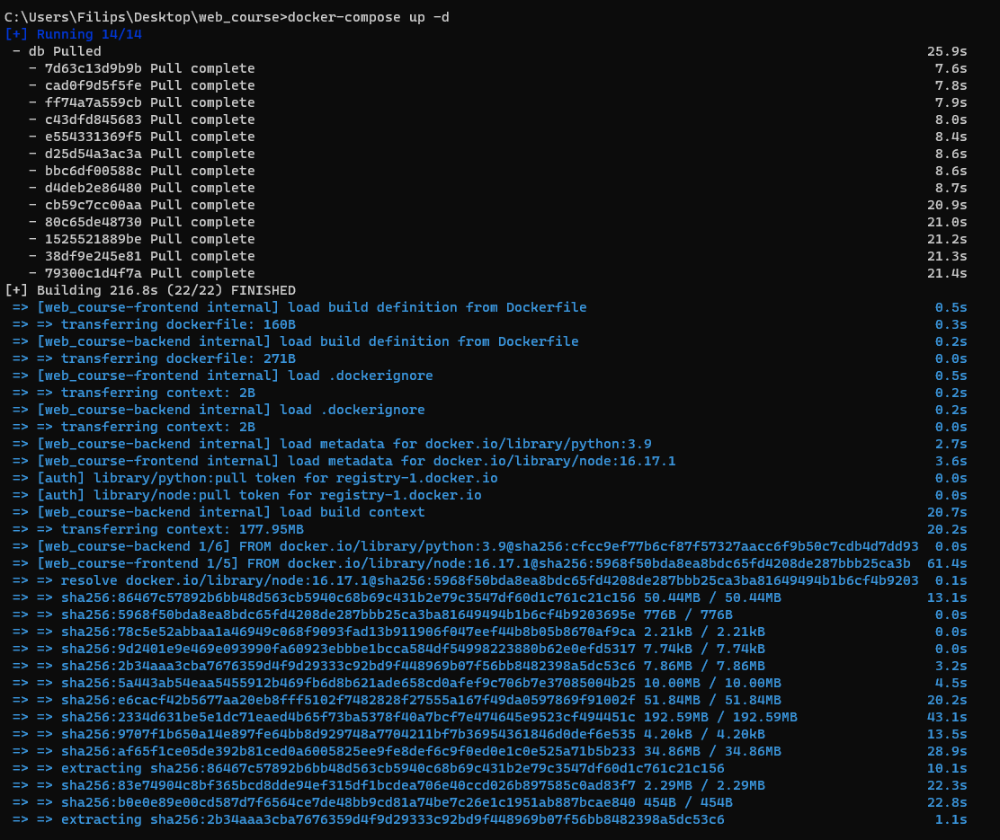
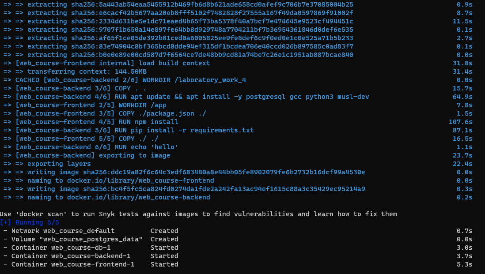
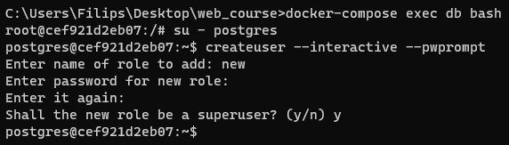
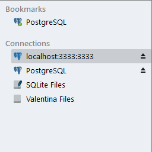
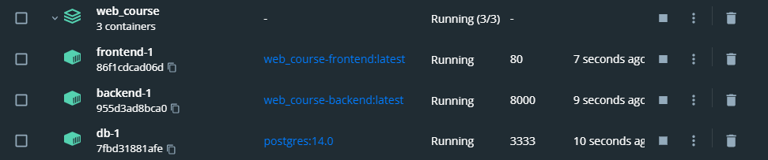

#### Задание:

1. Реализовать работу в оркестре всех сервисов из 3 и 4 работы из курса "Web-программирование".
2. Выполнить команды необходимые для того, чтобы добавить нового пользователя в БД Postgres. С попощью пользователя
   должна быть возможность подключиться к БД из приложения для работы с БД (Valentina DB).

### docker-compose.yml

```yaml
version: '3.10'

services:
  backend:
    build: ./ad_agency/
    command: bash -c "
      python3 manage.py makemigrations
      && python3 manage.py migrate
      && python3 manage.py runserver 0.0.0.0:8000";
    volumes:
      - ./ad_agency/:/app/
    ports:
      - 8000:8000
    env_file:
      - ./ad_agency/.env.dev
    depends_on:
      - db

  frontend:
    build: ./ad_agency_vue/
    ports: 
      - 80:8080
    depends_on:
      - backend

  db:
    image: postgres:14.0
    volumes:
      - postgres_data:/var/lib/postgresql/data/
    environment:
      - POSTGRES_USER=postgres
      - POSTGRES_PASSWORD=1602
      - POSTGRES_DB=hotel_db
    ports:
      - 3333:5432

volumes:
  postgres_data:
```





Добавим нового пользователя в БД Postgres.



Доступ к БД получен:



Все части проекта в контейнере

