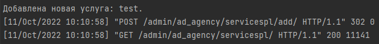
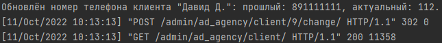
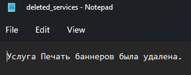

#### Задание 2.4.1

Реализовать 3 сигнала, которые:

- Вызывает логику, во время создания экземаляра объекта.
- Сохраняет значения выбранных полей в таблице в специальные поля для хранения предыдущих значений при обновлении объекта.
- При удалении объекта записывает информацию об удалении в лог реализованный любым образом.

### Для регистрации сигналов добавим конфигурацию ready в apps.py:

```python
from django.apps import AppConfig


class AdAgencyConfig(AppConfig):
    default_auto_field = 'django.db.models.BigAutoField'
    name = 'ad_agency'

    def ready(self):
        from . import signals
```

### Сигнал 1

```python
@receiver(post_save, sender=ServicesPL)
def create_service(sender, instance, created, **kwargs):
    if created:
        print(f'Добавлена новая услуга: {instance.title}.')
```



### Сигнал 2

```python
@receiver(pre_save, sender=Client)
def update_client(sender, instance, **kwargs):
    current = Client.objects.get(id=instance.id)
    if instance.phone_num != current.phone_num:
        instance.old_phone = current.phone_num
        print(f'Обновлён номер телефона клиента "{instance.contact_person}": прошлый: {instance.old_phone}, '
              f'актуальный: {instance.phone_num}.')
    else:
        print('Новый номер телефона совпадает с прошлым.')
```


### Сигнал 3 (вывод в txt файл)

```python
@receiver(pre_delete, sender=ServicesPL)
def delete_service(sender, instance, **kwargs):
    with open('deleted_services.txt', 'a', encoding='utf-8') as f:
        f.write(f'Услуга {instance.title} была удалена.')
```


