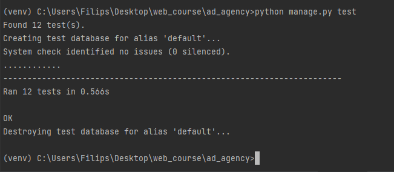

### tests.py
```python
from django.test import TestCase
from django.urls import reverse
from rest_framework import status

from .models import *


# Create your tests here.

# Тест модели API (3 таблицы)

class ClientModelTest(TestCase):
    @classmethod
    def setUpTestData(cls):
        Client.objects.create(
            id=1,
            legal_entity='ITMO',
            contact_person='ITMO',
            phone_num='88005553535',
            email='itmo@itmo.ru',
            bank_details='5500745688881024')

    def test_client_label(self):
        client_test = Client.objects.get(id=1)
        field_label = client_test._meta.get_field('legal_entity').verbose_name
        self.assertEquals(field_label, 'Юридическое лицо')


class MaterialsPLModelTest(TestCase):
    @classmethod
    def setUpTestData(cls):
        MaterialsPL.objects.create(
            id=1,
            title='Craft Paper',
            description='Eco paper',
            price=250)

    def test_object_name_is_name(self):
        material = MaterialsPL.objects.get(id=1)
        expected_object_name = str(material.title)
        self.assertEquals(expected_object_name, str(material))


class ExecutorModelTest(TestCase):
    @classmethod
    def setUpTestData(cls):
        Executor.objects.create(
            id=1,
            full_name='Filips Urnezhus',
            phone_num='89817623066')

    def test_full_name_max_length(self):
        executor = Executor.objects.get(id=1)
        max_length = executor._meta.get_field('full_name').max_length
        self.assertEquals(max_length, 50)


# Тест модели API (3 GET запроса, 3 POST запроса, 3 PATCH запроса)


# GET Запросы


class ClientGetTest(TestCase):
    @classmethod
    def setUpTestData(cls):
        Client.objects.create(
            id=1,
            legal_entity='ITMO',
            contact_person='ITMO',
            phone_num='88005553535',
            email='itmo@itmo.ru',
            bank_details='5500745688881024')

    def test_get_service(self):
        url = reverse('ad_agency:client', args=['1'])
        data = {
            'id': 1,
            'legal_entity': 'ITMO',
            'contact_person': 'ITMO',
            'phone_num': '88005553535',
            'email': 'itmo@itmo.ru',
            'bank_details': '5500745688881024'}
        response = self.client.get(url, data, format='json')
        self.assertEqual(response.status_code, status.HTTP_200_OK)
        self.assertEqual(response.json(), data)


class MaterialsPLGetTest(TestCase):
    @classmethod
    def setUpTestData(cls):
        MaterialsPL.objects.create(
            id=1,
            title='Craft Paper',
            description='Eco paper',
            price=250)

    def test_get_material(self):
        url = reverse('ad_agency:material', args=['1'])
        data = {
            'id': 1,
            'title': 'Craft Paper',
            'description': 'Eco paper',
            'price': '250'}
        response = self.client.get(url, data, format='json')
        self.assertEqual(response.status_code, status.HTTP_200_OK)
        self.assertEqual(response.json(), data)


class ExecutorGetTest(TestCase):
    @classmethod
    def setUpTestData(cls):
        Executor.objects.create(
            id=1,
            full_name='Filips Urnezhus',
            phone_num='89817623066')

    def test_get_executor(self):
        url = reverse('ad_agency:executor', args=['1'])
        data = {
            'id': 1,
            'full_name': 'Filips Urnezhus',
            'phone_num': '89817623066'}
        response = self.client.get(url, data, format='json')
        self.assertEqual(response.status_code, status.HTTP_200_OK)
        self.assertEqual(response.json(), data)


# POST Запросы


class ClientCreateTest(TestCase):
    def test_create_client(self):
        url = reverse('ad_agency:client-create')
        data = {'legal_entity': 'Polytech',
                'contact_person': 'Polina',
                'phone_num': '88124503737',
                'email': 'poly@polytech.ru',
                'bank_details': '5512745688881024'}
        response = self.client.post(url, data, format='json')
        self.assertEqual(response.status_code, status.HTTP_201_CREATED)
        self.assertEqual(response.json(), data)


class MaterialsPLCreateTest(TestCase):
    def test_create_material(self):
        url = reverse('ad_agency:material-create')
        data = {'title': 'Bargain Paper',
                'description': 'Paper',
                'price': '150'}
        response = self.client.post(url, data, format='json')
        self.assertEqual(response.status_code, status.HTTP_201_CREATED)
        self.assertEqual(response.json(), data)


class ExecutorCreateTest(TestCase):
    def test_create_executor(self):
        url = reverse('ad_agency:executor-create')
        data = {'full_name': 'Polina Arhipova',
                'phone_num': '89212420014'}
        response = self.client.post(url, data, format='json')
        self.assertEqual(response.status_code, status.HTTP_201_CREATED)
        self.assertEqual(response.json(), data)


# UPDATE запросы


class ClientUpdateTest(TestCase):
    @classmethod
    def setUpTestData(cls):
        Client.objects.create(
            id=1,
            legal_entity='ITMO',
            contact_person='ITMO',
            phone_num='88005553535',
            email='itmo@itmo.ru',
            bank_details='5500745688881024')

    def test_update_client(self):
        url = reverse('ad_agency:client', args=['1'])
        data = {
            'id': 1,
            'legal_entity': 'ITMO',
            'contact_person': 'ITMO',
            'phone_num': '88005553535',
            'email': 'itmo@itmo.ru',
            'bank_details': '5500745688881024'}
        response_retrieve = self.client.get(url, format='json')
        self.assertEqual(response_retrieve.status_code, status.HTTP_200_OK)
        self.assertEqual(response_retrieve.json(), data)
        data['legal_entity'] = 'SPBSU'
        response_update = self.client.put(url, data, content_type='application/json')
        self.assertEqual(response_update.status_code, status.HTTP_200_OK)
        self.assertEqual(response_update.json(), data)


class MaterialsPLUpdateTest(TestCase):
    @classmethod
    def setUpTestData(cls):
        MaterialsPL.objects.create(
            id=1,
            title='Craft Paper',
            description='Eco paper',
            price=250)

    def test_update_material(self):
        url = reverse('ad_agency:material', args=['1'])
        data = {
            'id': 1,
            'title': 'Craft Paper',
            'description': 'Eco paper',
            'price': '250'}
        response_retrieve = self.client.get(url, format='json')
        self.assertEqual(response_retrieve.status_code, status.HTTP_200_OK)
        self.assertEqual(response_retrieve.json(), data)
        data['price'] = '300'
        response_update = self.client.put(url, data, content_type='application/json')
        self.assertEqual(response_update.status_code, status.HTTP_200_OK)
        self.assertEqual(response_update.json(), data)


class ExecutorUpdateTest(TestCase):
    @classmethod
    def setUpTestData(cls):
        Executor.objects.create(
            id=1,
            full_name='Filips Urnezhus',
            phone_num='89817623066')

    def test_update_executor(self):
        url = reverse('ad_agency:executor', args=['1'])
        data = {
            'id': 1,
            'full_name': 'Filips Urnezhus',
            'phone_num': '89817623066'}
        response_retrieve = self.client.get(url, format='json')
        self.assertEqual(response_retrieve.status_code, status.HTTP_200_OK)
        self.assertEqual(response_retrieve.json(), data)
        data['phone_num'] = '37127901977'
        response_update = self.client.put(url, data, content_type='application/json')
        self.assertEqual(response_update.status_code, status.HTTP_200_OK)
        self.assertEqual(response_update.json(), data)


```

